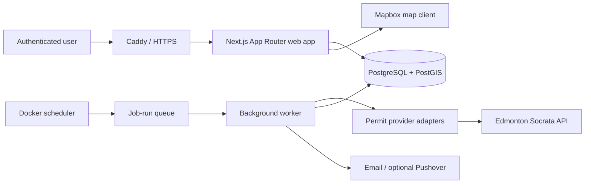

# Edmonton Infill Tracker

Edmonton Infill Tracker turns City of Edmonton permit records into address-level project timelines, confidence-ranked residential infill signals, and neighbourhood watchlists.

Phase 1 is implemented: the repository has a responsive product shell, strict TypeScript, a full Prisma/PostGIS model and migrations, deterministic seed data, database-backed email/password sessions, configurable classification primitives, tests, CI, and a self-hosted Docker layout for a Mac mini. The dashboard currently displays synthetic fixtures; live Socrata ingestion begins in Phase 2.

## Quick start

### Local app preview

Requirements: Node.js 22.13 or newer.

```sh
npm ci
cp .env.example .env
npm run prisma:generate
npm run dev
```

Open `http://localhost:3000`. The dashboard remains available without a database when `AUTH_REQUIRED=false`; production should keep `AUTH_REQUIRED=true`.

### Full development stack

Requirements: Docker Desktop for Mac.

```sh
cp .env.example .env
# Replace every placeholder password in .env.
docker compose -f docker-compose.dev.yml up --build
docker compose -f docker-compose.dev.yml run --rm web npm run prisma:seed
```

The application is available at `http://localhost:3000`, while development PostgreSQL is bound only to `127.0.0.1`. The seed is idempotent and creates synthetic Edmonton-like records, an admin, a standard user, and a saved search.

Development seed defaults are documented in `.env.example`; always replace them before using the app beyond a private local machine.

## Architecture



- **Web app:** Next.js App Router, React, strict TypeScript, Tailwind CSS, and source-owned shadcn-style components.
- **Database:** PostgreSQL 17 with PostGIS; Prisma 7 provides typed access through the PostgreSQL driver adapter.
- **Domain layer:** framework-independent address normalization, permit identity, project matching, classification, confidence scoring, saved-search matching, and alert deduplication.
- **Import layer:** provider interfaces will isolate Socrata field mappings from the domain. Raw records and normalized permit events have separate audited storage.
- **Jobs:** Docker-compatible worker and scheduler processes use persisted job records, explicit locks, counts, and structured logs. Phase 1 includes a database health job; import and alert handlers arrive in their respective milestones.
- **Authentication:** lowercase-normalized email accounts, bcrypt password hashes, opaque random sessions stored by token hash, secure HTTP-only cookies, role checks, same-origin checks, and login throttling.
- **Deployment:** Docker Compose runs database, migration, web, worker, scheduler, and Caddy services. PostgreSQL has no production host port.
- **Observability:** JSON process logs, import/job histories in PostgreSQL, and `/api/health` readiness reporting without secret details.

The app uses the Next.js programming model without depending on Vercel services. The current runtime is built through Vinext so the same product shell can be previewed and validated in a Cloudflare-compatible environment; the supported production target remains the Dockerized Mac mini stack.

## Repository structure

```text
app/                       App Router pages and server routes
components/ui/             Reusable shadcn-style UI primitives
src/domain/                Pure matching, classification, and alert rules
src/lib/                   Database, auth, logging, and request security
src/jobs/                  Docker worker and scheduler entry points
src/cli/                   Operator commands such as backfill queuing
prisma/                    Schema, PostGIS migrations, and synthetic seed
tests/unit/                Fast deterministic domain tests
tests/integration/         Cross-surface foundation checks
tests/e2e/                 Playwright user-flow smoke tests
deploy/                    Caddy and PostGIS image configuration
scripts/                   Container entrypoint and backup helper
docs/                      Deployment, operations, governance, and status
.github/                   CI, Dependabot, issue forms, and PR template
```

## Initial data model

| Area       | Main records                                    | Important guarantees                                                                                            |
| ---------- | ----------------------------------------------- | --------------------------------------------------------------------------------------------------------------- |
| Identity   | `User`, `Session`                               | Unique normalized email; only session-token hashes are stored; user/admin roles                                 |
| Geography  | `Neighbourhood`, `Address`                      | City neighbourhood ID and deterministic address key are unique; PostGIS polygon/point fields and GIST indexes   |
| Ingestion  | `ImportRun`, `RawPermitRecord`, `ImportFailure` | Raw payload audit trail; provider/source record uniqueness; created/updated/skipped/failed counts               |
| Permits    | `PermitEvent`                                   | One normalized event per provider/source ID with raw payload, source timestamps, address, and neighbourhood     |
| Projects   | `Project`, `ProjectEvent`                       | Address-level timeline, category, stage, value/units, structured confidence explanation, review and merge audit |
| Monitoring | `SavedSearch`, `SavedSearchNeighbourhood`       | Per-user filters, daily/immediate/weekly-ready cadence, pause/resume state                                      |
| Alerts     | `AlertEvent`                                    | Unique user + triggering event and explicit idempotency key prevent duplicate delivery                          |
| Operations | `JobRun`                                        | Durable status, lock key, start/completion times, counts, errors, and metadata                                  |

The Prisma source is `prisma/schema.prisma`. PostGIS is enabled before the initial schema migration so spatial columns and indexes are created predictably.

## Edmonton data assumptions

The first provider will read the City of Edmonton Socrata API through configurable adapters:

- [Development Permits](https://data.edmonton.ca/Urban-Planning-Economy/Development-Permits/2ccn-pwtu), dataset `2ccn-pwtu`, covers January 2015 onward and is described as updated daily.
- [General Building Permits](https://data.edmonton.ca/Urban-Planning-Economy/General-Building-Permits/24uj-dj8v), dataset `24uj-dj8v`, covers January 2009 onward and is described as updated daily.

The implementation will not assume either schema is permanent. Provider adapters must validate fields, page results, log requests, tolerate row-level errors, store raw JSON, and advance an incremental cursor only after durable processing. Dataset IDs, API base URL, page size, rate limit, and optional Socrata token all come from environment settings.

Additional assumptions:

- development and building permits are separate signals and may have different identifiers;
- descriptions and addresses are inconsistent prose, not reliable enums;
- a City address may be missing a unit, postal code, coordinate, or neighbourhood;
- neighbourhood boundaries may come from a separate public dataset;
- permit issuance indicates approval, not proof that construction began;
- a resale prediction is an inference and cannot be described as certainty;
- Realtor.ca or social-media comparison requires a separately authorized provider and is intentionally not implemented in Phase 1.

## Environment configuration

Copy `.env.example` to `.env`. Never commit the resulting file.

| Group             | Variables                                                                                      |
| ----------------- | ---------------------------------------------------------------------------------------------- |
| App/auth          | `APP_URL`, `AUTH_REQUIRED`, `INITIAL_ADMIN_EMAIL`, seed passwords                              |
| Database          | `DATABASE_URL`, `POSTGRES_DB`, `POSTGRES_USER`, `POSTGRES_PASSWORD`                            |
| Edmonton API      | `EDMONTON_SOCRATA_BASE_URL`, both dataset IDs, `SOCRATA_APP_TOKEN`, paging/retry/rate settings |
| Classification    | `INFILL_HIGH_VALUE_THRESHOLD`                                                                  |
| Map               | `NEXT_PUBLIC_MAPBOX_TOKEN`, `MAPBOX_STYLE_URL`                                                 |
| Email             | SMTP host, port, username, password, and sender                                                |
| Optional services | Pushover credentials and `SENTRY_DSN`                                                          |
| Processes         | Worker and scheduler intervals                                                                 |
| Hosting           | Docker image tag, Caddy address, HTTP and HTTPS ports                                          |

Only variables explicitly prefixed `NEXT_PUBLIC_` may reach browser code. All credentials stay server-side.

## Useful commands

```sh
npm run typecheck
npm run lint
npm run format:check
npm run test:unit
npm run test:integration
npm run build
npm run test:e2e

npm run prisma:generate
npm run prisma:migrate:dev
npm run prisma:migrate:deploy
npm run prisma:seed
npm run import:backfill -- --from=2026-01-01 --to=2026-01-31
```

## Implementation milestones

1. **Foundation:** repository/tooling, PostGIS schema, seed, authentication, product shell, tests, Docker, CI, and operator docs.
2. **Permit ingestion:** provider contract, Edmonton Socrata adapters, pagination/retry/rate limiting, raw storage, incremental/backfill imports, and summaries.
3. **Project intelligence:** address matching, project timelines, configurable classification/confidence, and manual review controls.
4. **User interface:** live dashboard, Mapbox explore view, projects table/detail, filters, CSV export, and responsive flows.
5. **Alerts:** saved-search UI, event matching, deduplicated daily email, history, and future Pushover hooks.
6. **Production readiness:** full health/data-quality operations, security/accessibility review, restore drill, and release process.

See [implementation status](docs/implementation-status.md) for the live checklist.

## Security, licensing, and data quality

- Admin authorization is enforced server-side. Login is same-origin checked and rate-limited; session cookies are HTTP-only, same-site, and secure in production.
- Permit text must be treated as untrusted. Future ingestion must validate with Zod and UI output must remain escaped/sanitized. Raw payloads remain admin-only.
- PostgreSQL is isolated on a private production Docker network. Expose only Caddy, and use HTTPS before access over untrusted networks.
- The app does not treat a confidence score as fact. Every score stores structured evidence and the UI must use qualified wording.
- City datasets are provided without warranty and can change. Preserve source timestamps, raw payloads, and attribution; review the [City of Edmonton Open Data licence](https://data.edmonton.ca/stories/s/City-of-Edmonton-Open-Data-Terms-of-Use/msh8-if28/) before distribution.
- Confirm Mapbox terms for the selected plan and do not scrape Realtor.ca or social networks without an authorized data source and legal review.
- Do not include production addresses, user emails, raw records, tokens, or `.env` values in fixtures, issues, screenshots, or logs.

## Operations and contribution docs

- [Mac mini deployment](docs/deployment/mac-mini.md)
- [HTTPS with Caddy](docs/deployment/https-with-caddy.md)
- [PostgreSQL backup and restore](docs/operations/postgres-backup.md)
- [Repository governance and branch protection](docs/repository/governance.md)

CI validates dependency installation, type checking, linting, unit/integration tests, production build, and Playwright smoke flows. It does not deploy to the Mac mini; the first release uses a documented backup-first manual update.
