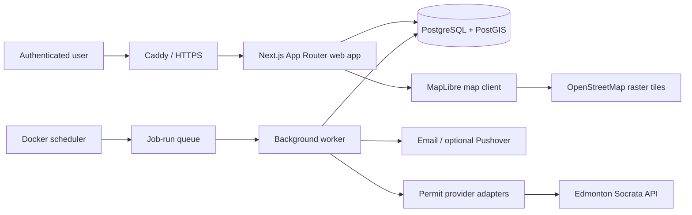

# Edmonton Infill Tracker

Edmonton Infill Tracker turns City of Edmonton permit records into address-level project timelines, confidence-ranked residential infill signals, and neighbourhood watchlists.

Phases 1 through 4 are implemented: the repository has a responsive authenticated workspace, strict TypeScript, a full Prisma/PostGIS model and migrations, a guarded City permit-import pipeline, durable address-level project timelines, live overview metrics, URL-filtered project exploration, real-basemap MapLibre/list views, filtered CSV, project evidence, and audited administrator operations. The hosted no-database product preview is explicitly labelled and synthetic; the Mac mini never silently substitutes preview records for its private PostgreSQL data.

## Quick start

### Local app preview

Requirements: Node.js 22.13 or newer.

```sh
npm ci
cp .env.example .env
npm run prisma:generate
npm run dev
```

Open `http://localhost:3000`. The dashboard remains available without a database when `AUTH_REQUIRED=false`; production should keep `AUTH_REQUIRED=true`.

### Full development stack

Requirements: Docker Desktop for Mac.

```sh
cp .env.example .env
# Replace every placeholder password in .env.
docker compose -f docker-compose.dev.yml up --build
docker compose -f docker-compose.dev.yml run --rm web npm run prisma:seed
```

The application is available at `http://localhost:3000`, while development PostgreSQL is bound only to `127.0.0.1`. The seed is idempotent and creates synthetic Edmonton-like records, an admin, a standard user, and a saved search. Both seed passwords must be supplied explicitly; there are no fallback credentials.

### Guided Mac mini install

The production installer expects Docker Desktop and Tailscale to be installed, running, and signed in. It derives the Mac's private `https://...ts.net` URL, starts with loopback ports `8080` and `8443`, and automatically advances to free ports if another local app already uses either one. Multiple Caddy containers can coexist because each receives distinct host ports. It also preserves existing Tailscale Serve routes, using HTTPS `443` when free or a dedicated port starting at `9443` when another app already owns `443`. The installer creates one administrator without demo data and enables Tailscale Serve. The administrator password is passed only to that one-time bootstrap container; it is not retained in `.env` or the long-running services. The installer never enables Tailscale Funnel.

```sh
git clone https://github.com/jdtoppin/edmonton-infill-tracker.git
cd edmonton-infill-tracker
./scripts/infill install
```

The installer is safe to rerun: Docker named volumes are retained and an existing `.env` is not replaced. Secrets and account settings are preserved; only local-port and private Tailscale URL settings may be reassigned when a conflict is found. If the initial run was interrupted before creating the administrator, the rerun asks for that password again without storing it. It stops if existing hosting settings are not loopback-only or do not match the current tailnet URL. The checked-in runtime trusts Caddy's forwarded HTTPS scheme but deliberately ignores forwarded hostnames; no Mini hostname or tailnet identity is stored in the repository. The operator's start, restart, and update commands also refuse to proceed unless every background and foreground Funnel configuration is confirmed off; stop remains available. Use the small operator command afterward:

```sh
./scripts/infill status
./scripts/infill logs worker
./scripts/infill backup
./scripts/infill update
./scripts/infill import 2025-01-01 2025-12-31 all
```

See the [Mac mini deployment guide](docs/deployment/mac-mini.md) for prerequisites, recovery, updates, and the complete command list.

## Architecture



- **Web app:** Next.js App Router, React, strict TypeScript, Tailwind CSS, source-owned shadcn-style components, server-side live read models, and progressively enhanced URL filters.
- **Database:** PostgreSQL 17 with PostGIS; Prisma 7 provides typed access through the PostgreSQL driver adapter.
- **Domain layer:** framework-independent address normalization, permit identity, project matching, classification, confidence scoring, saved-search matching, and alert deduplication.
- **Import layer:** provider interfaces isolate Socrata field mappings from the domain. HTTPS host allowlisting, schema/revision/count guards, bounded responses, retries, raw-first persistence, canonical checksums, and row quarantine protect the normalized store.
- **Jobs:** Docker-compatible worker and scheduler processes use persisted job records, database-enforced conflict keys, renewable leases, crash recovery, counts, and structured logs. The scheduler checks both permit datasets daily, using the persisted last scheduled run so restarts do not trigger extra imports, then matches permits into projects and reapplies current scoring rules; manual date-range backfills use the same worker path and cannot overlap an active import.
- **Authentication:** lowercase-normalized email accounts, bcrypt password hashes, opaque random sessions stored by token hash, secure HTTP-only cookies, role checks, same-origin checks, and login throttling.
- **Deployment:** Docker Compose runs database, migration, web, worker, scheduler, and Caddy services. PostgreSQL has no production host port.
- **Observability:** JSON process logs, import/job histories in PostgreSQL, and `/api/health` readiness reporting without secret details.
- **Updates:** the administrator UI compares the compiled commit with the fixed public GitHub repository and copies the guarded host command. The web container receives no Docker socket, repository mount, arbitrary ref, or shell execution capability.

The app uses the Next.js programming model without depending on Vercel services. The current runtime is built through Vinext so the same product shell can be previewed and validated in a Cloudflare-compatible environment; the supported production target remains the Dockerized Mac mini stack.

## Repository structure

```text
app/                       App Router pages and server routes
components/ui/             Reusable shadcn-style UI primitives
components/workspace/      Authenticated, role-aware responsive shell
components/projects/       Filters, result table, accessible MapLibre map, and timeline
components/admin/          Import, review, and update controls
src/domain/                Pure matching, classification, and alert rules
src/lib/                   Database, auth, logging, and request security
src/providers/             Validated City permit provider contracts and adapter
src/services/permit-import Snapshot orchestration and audited persistence
src/services/project-intelligence
                            Persisted matching, aggregation, and admin review actions
src/services/project-read-model
                            Live dashboard, project queries, presentation, and safe CSV
src/services/admin/         Admin import, health, and application-update read models
src/jobs/                  Docker worker and scheduler entry points
src/cli/                   Operator commands such as backfill queuing
prisma/                    Schema, PostGIS migrations, and synthetic seed
tests/unit/                Fast deterministic domain tests
tests/integration/         Cross-surface foundation checks
tests/e2e/                 Playwright user-flow smoke tests
deploy/                    Caddy and PostGIS image configuration
scripts/                   Container entrypoint and backup helper
docs/                      Deployment, operations, governance, and status
.github/                   CI, Dependabot, issue forms, and PR template
```

## Initial data model

| Area       | Main records                                    | Important guarantees                                                                                          |
| ---------- | ----------------------------------------------- | ------------------------------------------------------------------------------------------------------------- |
| Identity   | `User`, `Session`                               | Unique normalized email; only session-token hashes are stored; user/admin roles                               |
| Geography  | `Neighbourhood`, `Address`                      | City neighbourhood ID and deterministic address key are unique; PostGIS polygon/point fields and GIST indexes |
| Ingestion  | `ImportRun`, `RawPermitRecord`, `ImportFailure` | Raw payload audit trail; provider/source record uniqueness; created/updated/skipped/failed counts             |
| Permits    | `PermitEvent`                                   | One normalized event per provider/source ID with raw payload, source timestamps, address, and neighbourhood   |
| Projects   | `Project`, `ProjectEvent`, `ProjectAction`      | Address timeline, computed/overridden category and stage, occupancy review flag, and actor-linked admin audit |
| Monitoring | `SavedSearch`, `SavedSearchNeighbourhood`       | Per-user filters, daily/immediate/weekly-ready cadence, pause/resume state                                    |
| Alerts     | `AlertEvent`                                    | Unique user + triggering event and explicit idempotency key prevent duplicate delivery                        |
| Operations | `JobRun`                                        | Durable status, lock key, start/completion times, counts, errors, and metadata                                |

The Prisma source is `prisma/schema.prisma`. PostGIS is enabled before the initial schema migration so spatial columns and indexes are created predictably.

## Edmonton data assumptions

The first provider reads the City of Edmonton Socrata API through configurable adapters:

- [Development Permits](https://data.edmonton.ca/Urban-Planning-Economy/Development-Permits/2ccn-pwtu), dataset `2ccn-pwtu`, covers January 2015 onward and is described as updated daily.
- [General Building Permits](https://data.edmonton.ca/Urban-Planning-Economy/General-Building-Permits/24uj-dj8v), dataset `24uj-dj8v`, covers January 2009 onward and is described as updated daily.

The implementation does not assume either schema is permanent. The City currently republishes complete snapshots, so a dataset revision only decides whether a snapshot needs processing; it is accepted only after schema validation, deterministic keyset paging, full row-count reconciliation, and durable row processing. Canonical raw-payload checksums make that process incremental at the record level. Dataset IDs, API base URL, page size, rate limit, request bounds, and optional Socrata token all come from environment settings.

Additional assumptions:

- development and building permits are separate signals and may have different identifiers;
- descriptions and addresses are inconsistent prose, not reliable enums;
- a City address may be missing a unit, postal code, coordinate, or neighbourhood;
- neighbourhood boundaries may come from a separate public dataset;
- permit issuance indicates approval, not proof that construction began;
- `occupancy_granted_date` is a City-recorded progress signal with limited historical coverage; blank means “not reported,” not “not occupied”;
- a resale prediction is an inference and cannot be described as certainty;
- REALTOR.ca, REW, Zolo, Zealty, and social-media comparison remain disabled until an authorized provider passes the documented audit.

See the [Edmonton source contract](docs/data-sources/edmonton-open-data.md) and [market-provider policy](docs/data-sources/market-provider-policy.md).

## Environment configuration

Copy `.env.example` to `.env`. Never commit the resulting file.

| Group             | Variables                                                                                      |
| ----------------- | ---------------------------------------------------------------------------------------------- |
| App/auth          | `APP_URL`, `AUTH_REQUIRED`, initial administrator email/password, seed-only credentials        |
| Database          | `DATABASE_URL`, `POSTGRES_DB`, `POSTGRES_USER`, `POSTGRES_PASSWORD`                            |
| Edmonton API      | `EDMONTON_SOCRATA_BASE_URL`, both dataset IDs, `SOCRATA_APP_TOKEN`, paging/retry/rate settings |
| Classification    | `INFILL_HIGH_VALUE_THRESHOLD`, `INFILL_EPISODE_GAP_DAYS`                                       |
| Map               | `MAP_TILE_URL`, optional `MAP_STYLE_URL`                                                       |
| Email             | SMTP host, port, username, password, and sender                                                |
| Optional services | Pushover credentials and `SENTRY_DSN`                                                          |
| Processes         | Worker and scheduler intervals                                                                 |
| Hosting           | Docker image tag, loopback bind address, Caddy address, local ports, Tailscale Serve port      |

The two map provider URLs reach browser code because each viewer's browser fetches the basemap. They are public configuration, not secret storage; never put credentials in either value. All application credentials stay server-side.

## Useful commands

```sh
npm run typecheck
npm run lint
npm run format:check
npm run test:unit
npm run test:integration
npm run build
npm run test:e2e

npm run prisma:generate
npm run prisma:migrate:dev
npm run prisma:migrate:deploy
npm run prisma:seed
npm run admin:bootstrap
npm run import:backfill -- --from=2026-01-01 --to=2026-01-31 --dataset=all

./scripts/infill help
```

## Implementation milestones

1. **Foundation:** repository/tooling, PostGIS schema, seed, authentication, product shell, tests, Docker, CI, and operator docs.
2. **Permit ingestion:** provider contract, Edmonton Socrata adapters, pagination/retry/rate limiting, raw storage, incremental/backfill imports, and summaries.
3. **Project intelligence:** address matching, project timelines, configurable classification/confidence, and manual review controls.
4. **User interface:** live dashboard, MapLibre explore view, projects table/detail, filters, CSV export, responsive flows, administrator operations, logout, and safe application-update status.
5. **Alerts:** saved-search UI, event matching, deduplicated daily email, history, and future Pushover hooks.
6. **Production readiness:** full health/data-quality operations, security/accessibility review, restore drill, and release process.

See [implementation status](docs/implementation-status.md) for the live checklist.

## Security, licensing, and data quality

- Admin authorization is enforced server-side. Login is same-origin checked and rate-limited; session cookies are HTTP-only, same-site, and secure in production.
- Permit text is treated as untrusted. Ingestion validates normalized fields with Zod, React keeps UI output escaped, and raw payloads remain admin-only.
- PostgreSQL is isolated on a private production Docker network. Expose only Caddy, and use HTTPS before access over untrusted networks.
- The app does not treat a confidence score as fact. Every score stores structured evidence and the UI must use qualified wording.
- City datasets are provided without warranty and can change. Preserve source timestamps, raw payloads, and attribution; review the [City of Edmonton Open Data licence](https://data.edmonton.ca/stories/s/City-of-Edmonton-Open-Data-Terms-of-Use/msh8-if28/) before distribution.
- The default MapLibre basemap uses OpenStreetMap's standard raster tile service without an API key. Keep the required attribution visible, request only tiles needed for the interactive viewport, and follow the [OpenStreetMap tile usage policy](https://operations.osmfoundation.org/policies/tiles/).
- Map tile requests go directly from each viewer's browser to the configured provider. They contain tile coordinates and ordinary web request metadata, not permit records, project addresses, login data, or application credentials. See the [map provider policy](docs/data-sources/map-provider-policy.md) before changing providers.
- Do not automate market or social sources until an official API or connector passes the [market provider audit](docs/data-sources/market-provider-policy.md).
- Do not include production addresses, user emails, raw records, tokens, or `.env` values in fixtures, issues, screenshots, or logs.

## Operations and contribution docs

- [Mac mini deployment](docs/deployment/mac-mini.md)
- [HTTPS with Caddy](docs/deployment/https-with-caddy.md)
- [PostgreSQL backup and restore](docs/operations/postgres-backup.md)
- [Repository governance and branch protection](docs/repository/governance.md)

CI validates dependency installation, type checking, linting, unit/integration tests, production build, and desktop/mobile Playwright flows. It does not deploy to the Mac mini. The update page deliberately hands installation to the documented backup-first host command.
